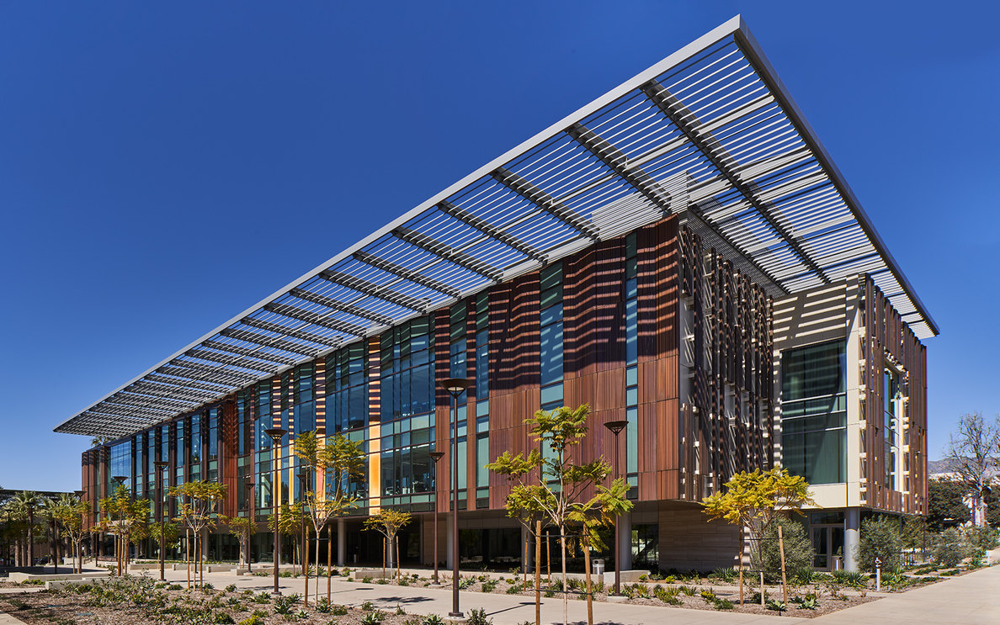

<h3 class='font-fancy'><i>To increase the speed, depth, and rigor of scientific return   by revealing new connections through data science.</i></h3>

Recent interdisciplinary collaborations between physical scientists and data scientists have yielded significant advancements in both fields. In order to establish a strong community of science and data science collaborators, we invite researchers, practitioners, leaders, and students to join us for our inaugural SUDS Conference.

This three-day conference will feature...
- Keynotes and panels from experts in SUDS-like collaborations
- Townhalls for findings from our [Workshop by institutional leaders](program/workshop.html)
- [Technical posters and talks](call.html) by researchers and students in this fast-growing community

## Dates and Logistics
- **Author Registration Opens:** &nbsp; July 22nd, 2024
- **Participant Registration Opens:** &nbsp; August 12th, 2024
- **Schedule Releases:** &nbsp; August 12th, 2024
- **Conference:** &nbsp; August 21-23rd, 2024
- **Location:** &nbsp; Chen Neuroscience Research Building, California Institute of Technology, Pasadena, CA
- **Attendees:** &nbsp; 200 participants, accepted authors prioritized

## Contributors
### Keynote Speakers

| - | - |
|  | [**Dr. Amy McGovern**](https://mcgovern-fagg.org/amy/) is the director of the NSF AI Institute on Trustworthy AI in Weather, Climate, and Coastal Oceanography (AI2ES), and holds dual appointments in the School of Computer Science and the School of Meteorology at the University of Oklahoma. Her research focuses on developing and applying machine learning and data mining methods for real-world applications with a special interest in high-impact weather phenomena including tornados, hail, severe wind events, flooding, drought, and aircraft turbulence.|
|  | [**Dr. Anima Anandkumar**](https://www.eas.caltech.edu/people/anima) is the Bren Professor of Computing and Mathematical Sciences at the California Institute of Technology, and co-founder of the AI4Science initiative at Caltech. Her research interests are in the areas of large-scale machine learning, non-convex optimization and high-dimensional statistics. In particular, she has been spearheading the development and analysis of tensor algorithms for machine learning. |
|  | [**Dr. Rose Yu**](https://datascience.ucsd.edu/people/rose-yu/) is an Assistant Professor at the UC San Diego, Department of Computer Science and Engineering. Her research focuses on advancing machine learning techniques for large-scale spatiotemporal data analysis, with applications to sustainability, health, and physical sciences. A particular emphasis of her research is on physics-guided AI which aims to integrate first-principles with data-driven models. |
|  | [**Dr. Jennifer Ngadiuba**](https://www.turing.ac.uk/people/guest-speakers/jennifer-ngadiuba) is Associate Scientist with Wilson Fellowship at the Fermi National Accelerator Laboratory, the leading facility for particle physics research in the United States. She is specialised in the application of AI to particle physics towards more intelligent detector systems, data reduction and data analysis strategies. This ensures the efficient extraction of the most fundamental physics information from the multitude of data collected at the Large Hadron Collider (LHC), the world's highest-energy particle physics experiment located at the CERN laboratory (Switzerland-France). |
|  | [**Dr. Elizabeth Davison**](https://www.chapman.edu/engineering/about/faculty/affiliate-faculty/elizabeth-davison.aspx) is an Associate Principal Director at The Aerospace Corporation and a Professor of Practice in the Champman University Fowler School of Engineering. Her research interests center around the application and development of mathematical methods from an engineering and physics perspective to examine complex dynamical systems. |

### Organizing Committee
- [Lukas Mandrake](https://ml.jpl.nasa.gov/alumni/lukas-mandrake.html) (NASA/Caltech JPL; Earth Data Science and Technology)
- [Erika Podest](https://science.jpl.nasa.gov/people/Podest/) (NASA/Caltech JPL; Carbon Cycle and Ecosystems)
- [Ryan McGranaghan](https://ml.jpl.nasa.gov/members/ryan-mcgranaghan.html) (NASA/Caltech JPL; Machine Learning and Instrument Autonomy)
- [Jake Lee](https://ml.jpl.nasa.gov/members/jake-lee.html) (NASA/Caltech JPL; Machine Learning and Instrument Autonomy)
- [Sam Berndt](https://www.linkedin.com/in/samberndt/) (NASA/Caltech JPL; Future Technology Exploration and Infusion)
- [Marcel Kaufmann](http://www.kaufmann.space/) (NASA/Caltech JPL; Future Technology Exploration and Infusion)

### Steering Committee
- [Anthony Arendt](https://escience.washington.edu/member/anthony-arendt/) (University of Washington; eScience Institute)
- [Chris Bard](https://ael.gsfc.nasa.gov/cisto/bio/christopher.m.bard) (NASA Goddard; Center for HelioAnalytics)
- [Rajesh Gupta](https://datascience.ucsd.edu/people/rajesh-gupta/) (UC San Diego; Halıcıoğlu Data Science Institute)
- [Amy McGovern](https://mcgovern-fagg.org/amy/) (University of Oklahoma; NSF AI2ES AI Institute)
- [Barbara Thompson](https://en.wikipedia.org/wiki/Barbara_J._Thompson) (NASA Goddard; Center for HelioAnalytics)
- [Kiri Wagstaff](https://www.wkiri.com/) (AAAS Science & Technology Policy Fellow)

Thank you for your interest, and we hope to see you there!
